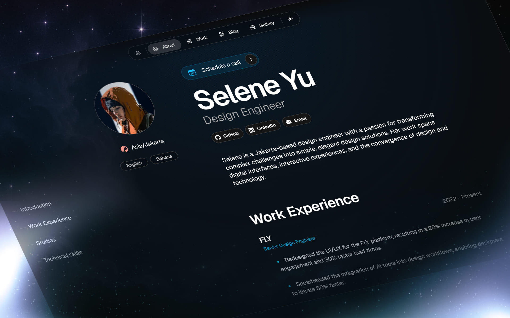

<<<<<<< HEAD
# Magic Portfolio

Magic Portfolio is a simple, clean, beginner-friendly portfolio template. It supports an MDX-based content system for projects and blog posts, an about / CV page and a gallery.

View the demo [here](https://demo.magic-portfolio.com).



## Getting started
=======
# **Magic Portfolio by Once UI**

View the [demo here](https://demo.magic-portfolio.com).


# **Getting started**

Magic Portfolio was built with [Once UI](https://once-ui.com) for [Next.js](https://nextjs.org). It requires Node.js v18.17+.
>>>>>>> 6e093c82ca0ba41cdf77be171e75324cef2269cd

**1. Clone the repository**
```
git clone https://github.com/once-ui-system/magic-portfolio.git
```

**2. Install dependencies**
```
npm install
```

**3. Run dev server**
```
npm run dev
```

**4. Edit config**
```
<<<<<<< HEAD
src/resources/once-ui.config.js
=======
src/app/resources/config
>>>>>>> 6e093c82ca0ba41cdf77be171e75324cef2269cd
```

**5. Edit content**
```
<<<<<<< HEAD
src/resources/content.js
=======
src/app/resources/content
>>>>>>> 6e093c82ca0ba41cdf77be171e75324cef2269cd
```

**6. Create blog posts / projects**
```
Add a new .mdx file to src/app/blog/posts or src/app/work/projects
```

<<<<<<< HEAD
Magic Portfolio was built with [Once UI](https://once-ui.com) for [Next.js](https://nextjs.org). It requires Node.js v18.17+.

## Documentation

Docs available at: [docs.once-ui.com](https://docs.once-ui.com/docs/magic-portfolio/quick-start)

## Features

### Once UI
- All tokens, components & features of [Once UI](https://once-ui.com)

### SEO
- Automatic open-graph and X image generation with next/og
- Automatic schema and metadata generation based on the content file

### Design
=======
# **Documentation**

Docs available at: [docs.once-ui.com](https://docs.once-ui.com/docs/magic-portfolio/quick-start)

# **Features**

## **Once UI**
- All tokens, components & features of [Once UI](https://once-ui.com)

## **SEO**
- Automatic open-graph and X image generation with next/og
- Automatic schema and metadata generation based on the content file

## **Design**
>>>>>>> 6e093c82ca0ba41cdf77be171e75324cef2269cd
- Responsive layout optimized for all screen sizes
- Timeless design without heavy animations and motion
- Endless customization options through [data attributes](https://once-ui.com/docs/theming)

<<<<<<< HEAD
### Content
=======
## **Content**
>>>>>>> 6e093c82ca0ba41cdf77be171e75324cef2269cd
- Render sections conditionally based on the content file
- Enable or disable pages for blog, work, gallery and about / CV
- Generate and display social links automatically
- Set up password protection for URLs

<<<<<<< HEAD
### Localization
- A localized, earlier version of Magic Portfolio is available with the next-intl library
- To use localization, switch to the 'i18n' branch

## Creators

Lorant One: [Threads](https://www.threads.net/@lorant.one) / [LinkedIn](https://www.linkedin.com/in/lorant-one/)

## Get involved

- Join the Design Engineers Club on [Discord](https://discord.com/invite/5EyAQ4eNdS) and share your project with us!
- Deployed your docs? Share it on the [Once UI Hub](https://once-ui.com/hub) too! We feature our favorite apps on our landing page.

## License

Distributed under the CC BY-NC 4.0 License.
- Attribution is required.
- Commercial usage is not allowed.
- You can extend the license to [Dopler CC](https://dopler.app/license) by purchasing a [Once UI Pro](https://once-ui.com/pricing) license.

See `LICENSE.txt` for more information.

## Deploy with Vercel

=======
## **Localization**
- A localized version of Magic Portfolio is available with the next-intl library
- To use localization, switch to the 'i18n' branch

# **Authors**

Connect with us on Threads or LinkedIn.

Lorant Toth: [Threads](https://www.threads.net/@lorant.one), [LinkedIn](https://www.linkedin.com/in/tothlorant/)  
Zsofia Komaromi: [Threads](https://www.threads.net/@zsofia_kom), [LinkedIn](https://www.linkedin.com/in/zsofiakomaromi/)

Localization added by [François Hernandez](https://github.com/francoishernandez)

# **Get involved**

- Join the [Design Engineers Club on Discord](https://discord.com/invite/5EyAQ4eNdS) and share your portfolio with us!
- Report a [bug](https://github.com/once-ui-system/magic-portfolio/issues/new?labels=bug&template=bug_report.md).

# **License**

Distributed under the CC BY-NC 4.0 License.
- Commercial usage is not allowed.
- Attribution is required.
- You can extend the license to commercial use by purchasing a [Once UI Pro](https://once-ui.com/pricing) license.

See `LICENSE.txt` for more information.

# **Deploy with Vercel**
>>>>>>> 6e093c82ca0ba41cdf77be171e75324cef2269cd
[](https://vercel.com/new/clone?repository-url=https%3A%2F%2Fgithub.com%2Fonce-ui-system%2Fmagic-portfolio&project-name=portfolio&repository-name=portfolio&redirect-url=https%3A%2F%2Fgithub.com%2Fonce-ui-system%2Fmagic-portfolio&demo-title=Magic%20Portfolio&demo-description=Showcase%20your%20designers%20or%20developer%20portfolio&demo-url=https%3A%2F%2Fdemo.magic-portfolio.com&demo-image=%2F%2Fraw.githubusercontent.com%2Fonce-ui-system%2Fmagic-portfolio%2Fmain%2Fpublic%2Fimages%2Fog%2Fhome.jpg)